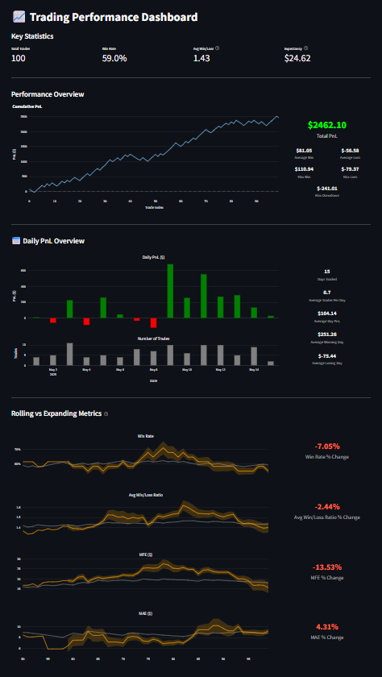

# 📈 Trading Dashboard

A custom-built performance dashboard to support data-driven trading improvement — designed for discretionary futures traders who value insight over surface-level stats.

> ⚠️ **Work in Progress**: This project is still under active development.

### ❓ Why This Project

Most trading analytics platforms are either **prohibitively expensive** or offer **limited real insight** into a trader’s process and edge. Many tools focus on basic stats without helping traders ask better questions or refine decision-making.

This project was born out of the need for a **custom, intelligent dashboard** that goes beyond simple performance tracking — offering clarity, flexibility, and depth for serious self-review.

---

## ✅ Current Features

* Key statistics overview
* Cumulative PnL plot with related statistics
* Daily PnL overview with related statistics
* Rolling performance stats (last 30 trades vs full sample)



## 🔜 Planned Features

The following features are planned or under development:

* CSV file upload with Sierra Chart trades data
* Time-of-day and day-of-week performance stats
* Win/loss streak tracking
* Profit distribution visualization
* Interactive filters (by setup, tag, date range, etc.)
* Automatic review generation using LLMs
* Alerts for performance anomalies or milestones

*(More to be added)*

## 🛠️ Tech Stack

* **Python** – Programming language
* **Pandas** - Data processing and analysis
* **Streamlit** – Interactive UI
* **Plotly** – Custom visualizations

## 🚀 Getting Started

1. Clone the repo:

```bash
git clone https://github.com/JasperLinders/trading_dashboard.git
cd trading_dashboard
```
2. Set up a virtual environment and install dependencies:

```
python -m venv venv
venv\Scripts\activate
pip install -r requirements.txt
```
3. Launch the app:

```
streamlit run app.py
```
